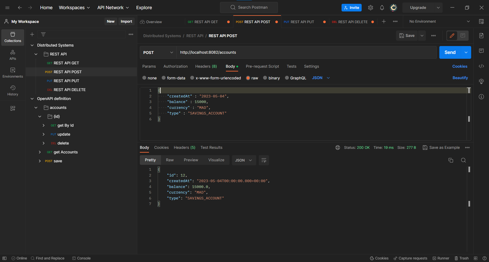
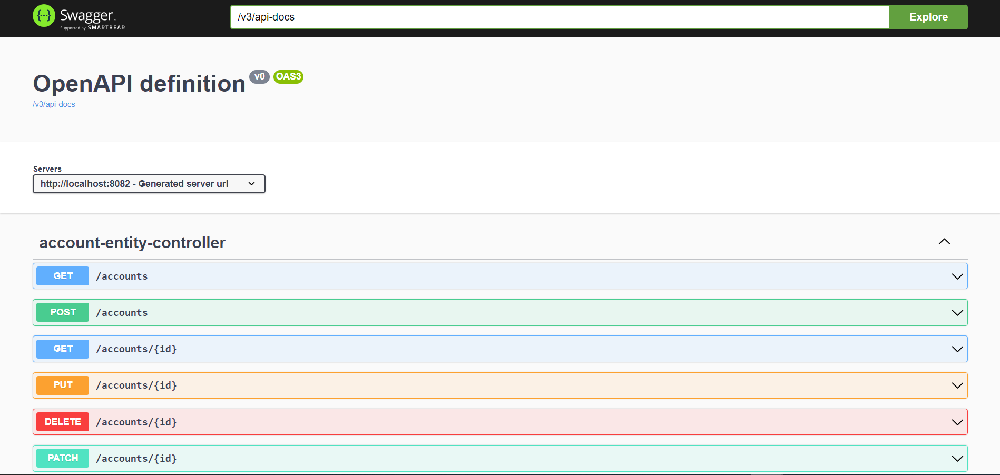
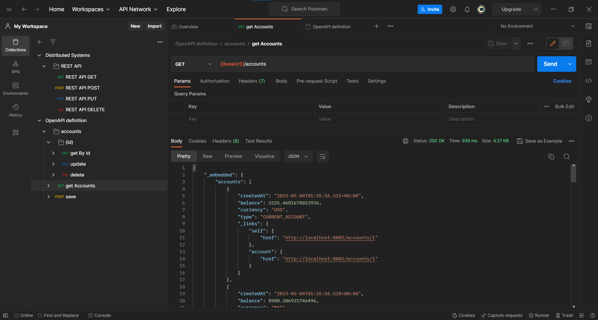
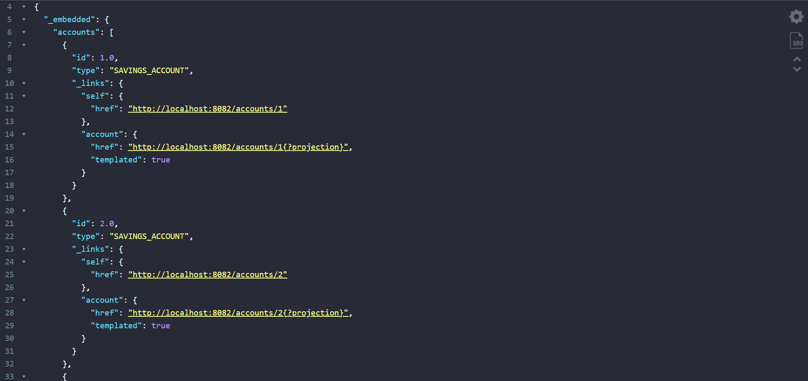

# Java micro-services architecture


## Overview
This project is a Java Spring Boot application that demonstrates the usage of various web service technologies such as REST, SOAP, GraphQL, and gRPC. The application will be built as a microservice using JPA for data persistence and H2 as an in-memory database. It will expose a variety of APIs for managing user accounts and demonstrate how to use these web service technologies in a single application. The project will also involve generating and testing Swagger documentation, utilizing Spring Data Rest and projections, creating DTOs and Mappers, and implementing a Service layer for the microservice. Finally, a GraphQL Web service will be created to showcase the usage of GraphQL in a microservice architecture.

## Dependencies:

| Dependency           | Description                                                                                                                                                                           |
|----------------------|---------------------------------------------------------------------------------------------------------------------------------------------------------------------------------------|
| Spring Boot Web      | Framework for building web applications with Spring Boot.                                                                                                                             |
| Spring Data JPA      | Interface for working with relational databases using Java Persistence API (JPA).                                                                                                     |
| Spring Boot DevTools | Provides fast application restarts, LiveReload, and configurations for enhanced development experience. (See how to configure it [here](#dev-tools-config))                           |
| Spring Doc OpenAPI   | java library helps to automate the generation of API documentation using spring boot projects.(<a href="https://springdoc.org/v2/" target = "_blank">Open API for spring-boot v3</a>) |
| H2 Database          | Lightweight, in-memory database for testing and development.                                                                                                                          |
| Lombok               | Library that helps to reduce boilerplate code in Java.                                                                                                                                |
| Spring Data Rest     | Quick and easy way to create RESTful web services based on Spring Data repositories.                                                                                                  |
| Spring for GraphQL   | Build GraphQL applications with Spring for GraphQL and GraphQL Java.                                                                                                                  |

## REST API test
### REST API test with Postman


### Open API Documentation and test with Postman
1. Navigate to the following URL in your browser: `http://localhost:8082/swagger-ui.html`


2. Copie the `/v3/api-docs` link and import it on your Postman interface to generate the OpenAPI definition


### Projections with REST API
A simple projection of Ids and Account types:
```java
@Projection(name = "p1", types = Account.class)
public interface AccountProjection {
    public Double getId();
    public AccountType getType();
}
```
<p style="color: tomato; font-family:arial; font-size: 20px">Note !</p>

When you define a projection for an entity, it should be in the same package as the entity because Spring Data REST uses component scanning to find projections. If you define the projection in a different package, you will need to manually register it with Spring Data REST.

To use this projection
```
 http://localhost:8082/accounts?projection=p1
```
Results:



### <h3 id = "dev-tools-config">DevTools Configuration in IntelliJ</h3>
1. Go to *'Settings/Build, Execution, Deployment/Compiler'* and check *'Build Project Automatically'*

2. Go to *'Settings/Advanced settings'* and check *'Allow auto-make to start even if developed application is currently running '*

